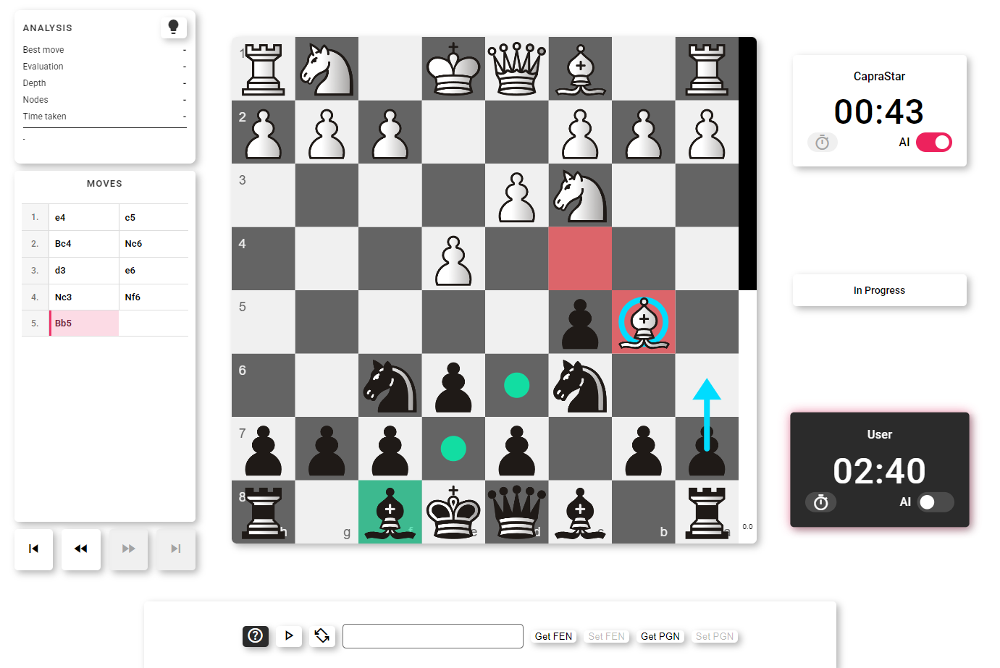
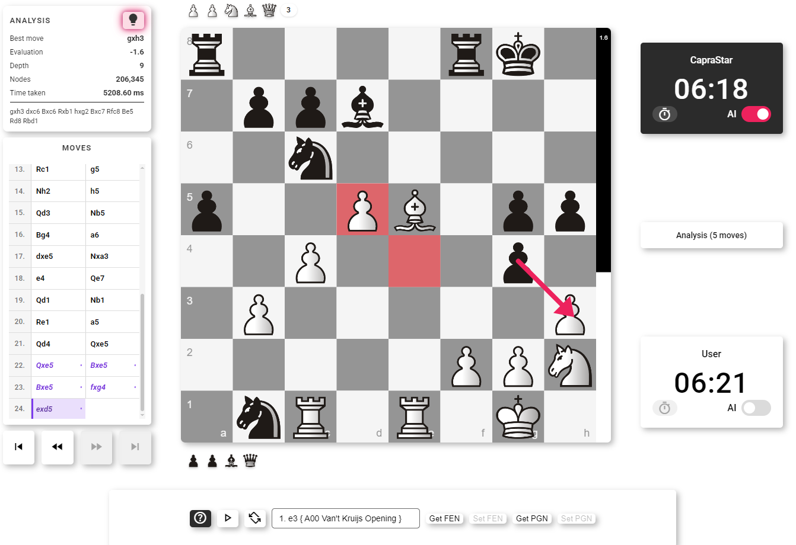

<p align="center">
  <a href="docs/CapraStar.png"></a>
</p>

# CapraStar 🐐🌟

CapraStar is an open-source 1900+ ELO (on Lichess) chess engine written in JavaScript from scratch. It includes a browser UI client powered by p5.js and a Node.js command-line interface that speaks the [UCI protocol](https://en.wikipedia.org/wiki/Universal_Chess_Interface).

The project shares the same chess rules, evaluation, search, opening-book, and time-management code across both runtimes.

Try the [live browser demo](https://editor.p5js.org/brownmakey243/full/A80PMc3Xj).

You can also [challenge CapraStar on Lichess](https://lichess.org/@/CapraStar).

> It accepts challenges for the following variations:
>
> <ul>
> <li> Standard </li>
> <li> From Position </li>
> </ul>
>
> In Bullet, Blitz, and Rapid time controls.

---

## Screenshots

<p align="center">
  <a href="docs/game.PNG"></a>
  <br><sub>Play against the AI</sub>
</p>
<p align="center">
  <a href="docs/review1.PNG"></a>
  <br><sub>Alternate line analysis</sub>
</p>

---

## Features

### Chess engine

- Board representation, legal move generation, and game state handling
- Alpha-beta search with move ordering, transposition tables, and time management (node count, fixed time, and dynamic allocation based on position complexity estimation and time left)
- Quiescence search with static exchange evaluation and delta pruning
- Draw detection by repetition and insufficient material
- Handcrafted evaluation terms and iterative deepening search
- Principal variation search, and history and killer-move heuristics
- Null move pruning, futility pruning and aspiration windows
- Default parameters tuned with SPSA and tested with SPRT
- Opening-book support

### Browser client

- Interactive p5.js chessboard with piece, sound, and board-theme assets
- Responsive UI for mobile devices
- Play locally against the AI or use the board for two-player games
- Independently configurable clocks and increments for white and black
- Analysis panel showing the best move, evaluation, depth, nodes, time, and principal variation in real-time
- Move navigation, board flipping, premoves, and board annotations
- Engine search and evaluation run in a Web Worker to keep the interface responsive
- FEN position loading and PGN import/export in the browser client
- Undo and redo move options
- Postgame analysis for alternate lines

### UCI interface

- Startable with `npm run uci`
- Supports standard UCI commands including `uci`, `isready`, `ucinewgame`, `position`, `go`, `stop`, and `quit`
- Supports hash sizing, pondering, opening-book loading, and engine evaluation options

---

## Technology Stack

| Area                            | Technology                                                                                                                                                                                                                                 |
| ------------------------------- | ------------------------------------------------------------------------------------------------------------------------------------------------------------------------------------------------------------------------------------------ |
| **Language**                    |                                                                                                                                  |
| **Browser UI**                  |    |
| **Browser engine runtime**      |                                      |
| **Command-line engine runtime** |                                                                                              |
| **Engine**                      |                                                                                                                                                                          |

---

## Project Structure

```text
CapraStar/
├─ index.html                  # Browser application entry point
├─ help.html                   # In-app help content
├─ package.json                # UCI command
├─ README.md
│
├─ src/
│  ├─ chess/                   # Rules, board state, move generation, opening-book parser
│  ├─ engine/                  # Search, evaluation, time manager, transposition table
│  ├─ ui/                      # Browser UI, input, timers, annotations, game controller
│  ├─ worker/                  # Browser worker entry point
│  └─ uci/                     # Node.js UCI entry point and runtime adapter
│
├─ public/
│  ├─ assets/
│  │  ├─ images/               # Piece sets and UI images
│  │  └─ sounds/               # Move and game sound effects
│  ├─ data/
│  │  └─ Book.txt              # Opening-book data
│  └─ vendor/                  # Local p5.js copies
│
├─ styles/
│  └─ style.css
├─ docs/                       # README images
└─ archive/                    # Self-contained historical engine snapshots
```

---

## Project Architecture

```text
                    ┌──────────────────┐
                    │   index.html     │
                    │  Browser client  │
                    └────────┬─────────┘
                             │
             ┌───────────────┴───────────────┐
             │                               │
             ▼                               ▼
   ┌──────────────────┐            ┌──────────────────┐
   │ src/ui           │            │ src/worker       │
   │ Input, board, UI │◀─────────▶│ CapraWorker.js   │
   └──────────────────┘  messages  └────────┬─────────┘
                                            │
                         ┌──────────────────┴───────────────────┐
                         ▼                                      ▼
               ┌──────────────────┐                    ┌──────────────────┐
               │ src/chess        │                    │ src/engine       │
               │ Rules and state  │                    │ Search/evaluation│
               └──────────────────┘                    └──────────────────┘
                                                                 ▲
                                                                 │
                                                        ┌────────┴───────────┐
                                                        │ src/uci/UCI.js     │
                                                        │ Node.js UCI        │
                                                        │ interface          │
                                                        └────────────────────┘
```

---

## Installation

### Prerequisites

- A modern browser for the web client
- [Node.js](https://nodejs.org/) 18 or newer for the UCI engine
- A local static web server for the browser client; do not open `index.html` directly because workers and loaded assets require HTTP(S)

### Run the browser client

Serve the project root with any static server, then open its displayed local URL. For example, with the VS Code **Live Server** extension, choose **Open with Live Server** on `index.html`.

The browser client loads p5.js from its CDN. Local copies are retained in `public/vendor/` for offline or self-hosted deployments.

### Run the UCI engine

```bash
npm run uci
```

The engine will wait for UCI commands on standard input. For a quick manual check:

```text
uci
isready
ucinewgame
position startpos
go movetime 1000
quit
```

---

## Development Notes

- `src/chess/` and `src/engine/` are runtime-neutral classic scripts. Keep browser and Node-specific APIs out of these folders.
- `src/worker/CapraWorker.js` loads the shared scripts with `importScripts` for the browser.
- `src/uci/loadNodeRuntime.js` evaluates the same shared scripts for Node.js.
- When adding a shared chess or engine file, add it to both runtime loading lists and preserve dependency order.
- The opening book is stored at `public/data/Book.txt` and is used by both the browser worker and UCI adapter.

---

## Historical Versions

Historical CapraStar snapshots live in [`archive/`](archive/). The active engine is in [`src/engine/`](src/engine/).

---

## Roadmap

- Add automated tests for move generation, perft, search behavior, and UCI commands
- Improve engine analysis controls and strength configuration
- Experiment with NNUE evaluation

---

## Contributing

Contributions, bug reports, and feature requests are welcome. Feel free to open an issue or submit a pull request.

---

## Author

Developed by **CapiMDR**.

If you enjoy the project, consider starring the repository ⭐.
